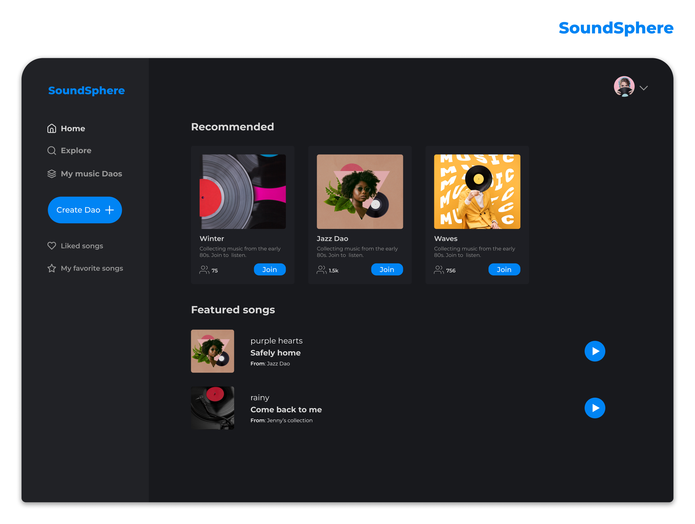
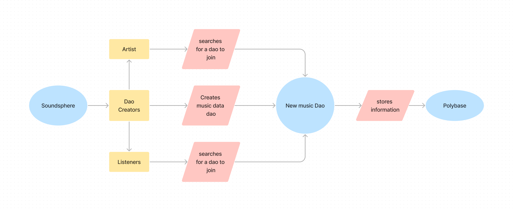
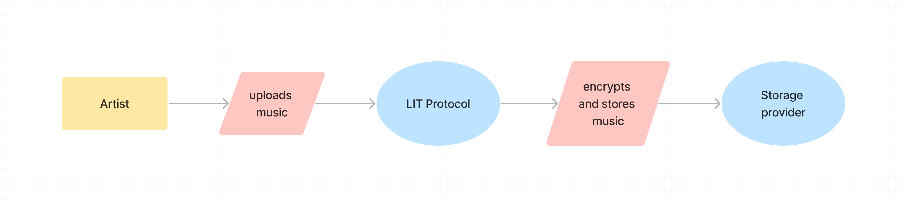
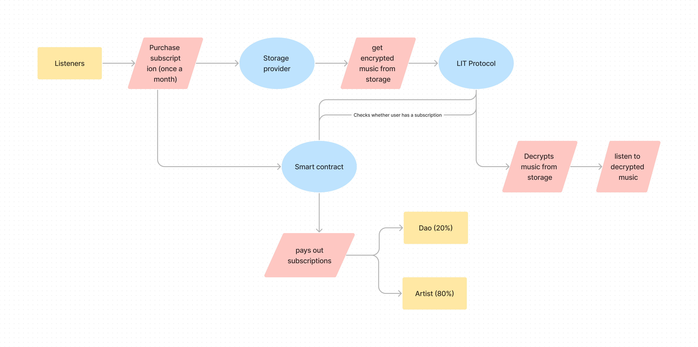

## Summary

SoundSphere is a platform that enables users to create and manage their own music Data DAOs. We see the music Data DAOs as virtual music labels that house music artists and their songs.

## Team Members

this project was built and designed by a team of 2 people [Liz](mailto:cre8ivliz@gmail.com) and [Kelvin Praises](mailto:cre8ivliz@gmail.com)

## Inspiration

We were inspired by how music files are sourced, stored, and listened to in traditional web platforms (web2), and we wanted to re-imagine this process using web3 tools.

## What it does

Our goal is to allow users create their own Data DAOs where they can invite artists and listeners who share their music interests.

Within these Data DAOs, users can upload songs, interact with other members, and listen to music. It's like having Facebook groups, but specifically designed for music.

Users have the ability to create their own music Data Dao or request to join existing ones on the platform. Each Data Dao can feature and promote music that they like.

## Technical Details

We hosted the smart contracts on hyperspace testnet and used the following tools to build the platform: Lit Protocol, Lighthouse, Spheron, and Polybase. The [SoundSphere](./contracts/soundSphere.sol) smart contract is used to govern the actions between the DAOs and the artists, track music played and also distribute revenue stream to both parties, while our [SST](./contracts/soundSphereToken.sol) token is for incentives and also paying of subscription. With this exploration, we wanted to focus on these main functions and features for this hackathon, which we believe are the most important for the platform:

1. Ability for any user to create and add a new data DAOs, to existing data DAOs that anyone—artists or listeners—can join and listen to music, each new DAO is stored on Polybase at the moment 

2. Allow Artists to upload and earn royalties from music, before which they need to call the **registerArtist** method once on the **SoundSphere Platform Contract**, encrypt music with **Lit Protocol** then upload the music to a **Storage Providers: Lighthouse or Spheron** 

3. Enable music listening inside a data DAO to only subscribers. Listeners can call the **subscribe** method on the **SoundSphere Platform Contract** and must already have some **SoundSphere Token (SST)**, then they get the music details from **Polybase** and the link to the encrypted asset hosted on **Filecoin** by the **Storage Providers: Lighthouse or Spheron** and then decrypted only when access conditions are met for having a valid subscription by **Lit Protocol**. Artists and music data DAOs can be paid by calling the **distributeRevenue** method 

## How to run

1. Clone the repo
2. Run `npm i` to install dependencies
3. Run `npm run dev` to start the app
4. create .env file and add the following variables
    - NEXT_PUBLIC_LIGHTHOUSE_API_KEY
    - NEXT_PUBLIC_SOUNDSPHERE_TOKEN_ADDRESS
    - NEXT_PUBLIC_SOUNDSPHERE_PLATFORM_ADDRESS
5. Visit `http://localhost:3000` to view the app

The smart contracts are deployed on the hyperspace testnet and the addresses are as follows:
1. SoundSphere token `0x3E315dA04D7BFFC60706fbc9b32ac7113B4FaCb4`
2. SoundSphere platform `0xaB5A53c71b5AA89D3Bf414d31d5F7c49aD847a11`